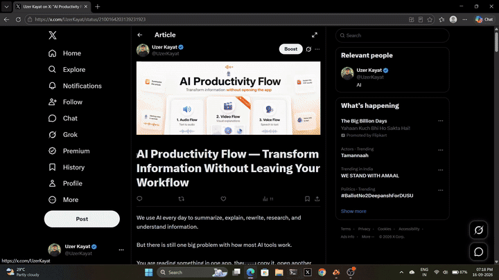
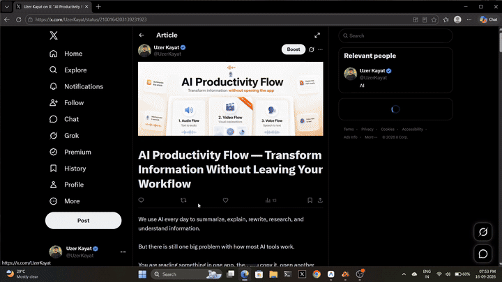

<h1 align="center">🌊 AI Productivity Flow</h1>

<p align="center">
  <b>Turn notes and documents into videos, text into audio, and speech into text — directly from your desktop.</b><br>
  <i>A free, lightweight, privacy-focused desktop AI assistant that operates seamlessly inside every app you already use.</i>
</p>

<p align="center">
  <a href="https://github.com/uzerkayat2004-gif/AI-Productivity-Flow/releases"></a>
  
  
  
  <a href="LICENSE"></a>
</p>

<p align="center">
  
</p>

---

## ⚡ What is AI Productivity Flow?

**AI Productivity Flow** is built around one core philosophy:
> **You shouldn't have to leave the app you're working in just to use AI.**

Forget switching browser tabs to ChatGPT, copy-pasting back and forth, or reading through grueling walls of text. Flow runs quietly in the background on your desktop. Whenever you need it, a simple mouse gesture or text selection unleashes instant transformation:

* 🎬 **Video Flow (Flagship Feature)** — Turn dense text, notes, or documents into polished, animated 1080p explainer videos with narration, dynamic visual scenes, and synchronized captions in seconds.
* 🎧 **Audio Flow** — Tired of reading? Highlight any text or article, and a sleek floating bar reads it out loud in warm, natural human voices with real-time yellow word tracking.
* 🎙️ **Voice Flow** — Speak naturally. It transcribes locally on your PC and types clean, formatted text directly into whatever app is open (Slack, Word, Gmail, VS Code, or your browser).
* 📓 **NotebookLM Magic** — Connect your Google research notebooks for instant access to your study guides, deep summaries, and audio discussions.
* 🔒 **Local & Private Dictation** — Core speech recognition runs entirely on your computer's CPU/GPU. Your microphone audio is never uploaded to cloud servers.

---

## 🚀 Quick Install (Get Started in 60 Seconds)

Choose the method that works best for your system:

### 🪟 Windows 10 & 11 (Primary & Fully Tested)

* **Option 1: The Easy 1-Line Command (Fastest)**  
  Press `Win + X`, open **PowerShell** (no Administrator privileges required), and paste:
  ```powershell
  irm https://raw.githubusercontent.com/uzerkayat2004-gif/AI-Productivity-Flow/main/scripts/install.ps1 | iex
  ```
  *(This automatically configures the environment, downloads local speech models, creates a Desktop shortcut, and launches Flow!)*

* **Option 2: Standalone Installer**  
  Prefer a classic setup executable? Download **`AI-Productivity-Flow-Setup-x64.exe`** directly from our **[GitHub Releases](https://github.com/uzerkayat2004-gif/AI-Productivity-Flow/releases)** page.

---

### 🍎 macOS 12+ Apple Silicon & Intel (Community Preview)

Open your Mac **Terminal** and paste:
```bash
curl -fsSL https://raw.githubusercontent.com/uzerkayat2004-gif/AI-Productivity-Flow/main/scripts/install.sh | bash
```

> [!WARNING]
> **⚠️ Note for Mac Users (Community Preview):**  
> macOS support is currently in **Community Preview** and has not yet undergone full physical hardware testing across all Apple Silicon and Intel generations. While core features run, you may encounter system permission prompts (Microphone, Accessibility, Input Monitoring) or minor hotkey quirks.  
>  
> **Windows 10/11 x64 is the primary, production-verified platform.** If you encounter any bugs on macOS, please help us improve by reporting them on [GitHub Issues](https://github.com/uzerkayat2004-gif/AI-Productivity-Flow/issues)!

---

## 💡 Everyday Magic: How You'll Use Flow Every Day

| What you want to do | How Flow makes it effortless |
| :--- | :--- |
| **Turn dense notes or a PDF into an explainer video** | Highlight text or drop a file (`.pdf`, `.docx`, `.txt`, `.md`). Click **Video**, and Flow writes a storyboard, designs animated visual scenes, narrates, and renders a 1080p MP4. |
| **Rest your eyes and listen to any text** | Highlight any paragraph on your screen. The **Audio Bar** appears immediately at your cursor, reading aloud in natural human voices with synchronized word tracking. |
| **Write an email or document without typing** | Hold your **Middle Mouse Button** (or press `Ctrl + Win`), speak naturally, and release. Flow transcribes locally and pastes formatted sentences directly into your active window. |
| **Access research from Google NotebookLM** | Sign in securely to sync your Google NotebookLM research notebooks directly into your desktop workflow. |

---

## 🌟 The Core Superpowers

### 1. 🎬 Video Flow — Turn Notes & Documents into 1080p Explainer Videos
Why struggle through dry walls of text when you can watch a concise, visually captivating explainer video? Video Flow is our flagship multimodal capability that bridges the gap between static text and rich educational video.

<p align="center">
  
  <br>
  <sub>🎬 <i>Live animated demo playing above. You can also <a href="https://github.com/uzerkayat2004-gif/AI-Productivity-Flow/raw/main/website/assets/video/videoflow_demo.mp4"><b>watch or download the full 1080p Video Flow MP4</b></a>.</i></sub>
</p>

* **Input Versatility**: Highlight any text on screen, paste notes, or drag-and-drop documents (`.txt`, `.md`, `.csv`, `.json`, `.html`, `.htm`, `.xml`, `.rtf`, `.docx`, `.pdf` up to 8 MB) directly into the composer.
* **Two Intelligent Pedagogical Modes**:
  * **Summary Mode**: Generates a fast, high-impact executive briefing capturing key takeaways and core concepts.
  * **Full Mode**: Constructs an in-depth, structured educational breakdown with detailed conceptual exploration.
* **Creative Director (15 Dynamic Visual Treatments)**: Avoids monotonous slides by dynamically varying scenes with:
  * Dynamic title cards and concept highlight cards
  * Animated process flowcharts and sequence timelines
  * Data metrics and animated quantitative counters
  * 3D WebGL scenes and spatial visualizations
  * Waveform displays, comparative tables, and recap grids
* **100% Free Deterministic Motion Renderer**: You do **not** need expensive paid generative video subscriptions. Video Flow uses bundled browser-based motion modules (HyperFrames/Narova/Code2Video) and FFmpeg to render finished 1080p H.264 MP4 videos locally with synchronized narration and captions.
* **Integrated Player & MP4 Export**: Watch directly inside the on-screen player with speed controls, timeline scrubber, subtitle toggles, and instant local MP4 file saving.

---

### 2. 🎧 Audio Flow — Turn Any Text Into Speech & Screen Reader
Transform any web page, research paper, code documentation, or email into an instant personal audio track.

<p align="center">
  
  <br>
  <sub>🎧 <i>Live animated demo playing above. You can also <a href="https://github.com/uzerkayat2004-gif/AI-Productivity-Flow/raw/main/website/assets/video/audioflow_demo.mp4"><b>watch or download the full Audio Flow MP4</b></a>.</i></sub>
</p>

* **Highlight & Listen**: Simply select any text on your screen (drag >= 6px). A floating player bar appears right next to your cursor.
* **Synchronized Yellow Word Tracking**: Words illuminate in real-time as they are spoken, making it effortless to follow along with dense documents.
* **Full Playback Control**: Adjust playback speed from 0.75x to 2.0x, scrub through the waveform bar, jump backward/forward, or save the synthesized speech as an MP3 file with one click.
* **Spoken AI Summaries**: Pressed for time? Choose between **Quick**, **Standard**, or **Detailed** AI summaries and have the essence synthesized and read aloud to you.
* **Free Natural Human Voices**: Ships with high-fidelity Microsoft Edge Neural voices out of the box with zero configuration or API keys required. Also supports cloud voices from Google, Gemini Audio, ElevenLabs, Deepgram, OpenAI, and NVIDIA if you connect your own keys.

---

### 3. 🎙️ Voice Flow — Talk Instead of Typing
Stop typing thousands of words every day. Speak naturally, and Flow will transcribe and type for you anywhere your cursor is placed. *(Note: Voice Flow focuses purely on text dictation inside your active applications).*

* **Effortless Triggers**:
  * **Push-to-Talk**: Hold down your **Middle Mouse Button** (scroll wheel) or press `Ctrl + Win` (`Cmd + Ctrl` on Mac) while speaking (>0.30s). Release when finished, and watch your words appear instantly.
  * **Hands-Free Dictation**: Quick-tap the mouse wheel (<0.30s) to toggle continuous dictation on or off. Press `Esc` at any time to cancel.
* **Smart Hesitation Cleaning**: Automatically cleans up slips of the tongue, pauses, and filler words ("um", "uh", "like") while strictly preserving your exact meaning and terminology.
* **App-Aware Contextual Formatting**:
  * **Word / Outlook / Gmail**: Automatically writes formal, well-punctuated, professional prose.
  * **Slack / Discord / Teams**: Formats casual, clear, friendly messages.
  * **VS Code / IDEs**: Detects code contexts and formats programming identifiers (`snake_case`, `camelCase`) and Markdown blocks.
* **Personal Dictionary & Custom Shortcuts**: Teach Flow your name, specialized technical jargon, or custom abbreviations (e.g. typing or saying `myzoom` instantly expands to your full Zoom meeting link).
* **100% Local Speech Engine**: Transcribes directly on your processor using offline Faster-Whisper (`base.en` CPU int8). Your microphone audio never leaves your computer.

---

### 4. 📓 NotebookLM Deep Research Integration
Bring the research power of Google NotebookLM directly into your daily desktop workflow:
* **One-Click Browser Sync**: Easily connect your Google account with automated session authentication.
* **Chrome 127+ App-Bound Encryption Support**: Robust cookie handling keeps your session alive across reboots and account switches without repeated login prompts.
* **Instant Research Summaries**: Pull your deep notes, study guides, and audio discussions directly into audio narrations or video explainers.

---

### 5. 🔑 Bring Your Own Key (BYOK) — Or Stay 100% Free
AI Productivity Flow is built to be accessible to everyone:
* **100% Free Out of the Box**: Offline speech-to-text dictation and natural Microsoft Edge voice synthesis require no accounts, no credit cards, and zero API keys.
* **Connect Any AI Provider (Optional)**: If you want to use cloud AI for smart text polishing, spoken summaries, or video scene planning, you can easily plug in your own API key:
  * **OpenAI** (GPT-4o, GPT-4o-mini, o1, o3-mini)
  * **Anthropic** (Claude 3.5 Sonnet, Claude 3.5 Haiku)
  * **Google Gemini** (Gemini 2.0 Flash, Gemini 1.5 Pro)
  * **DeepSeek, Groq, Mistral, NVIDIA NIM**
  * **Local Offline AI** via Ollama (completely free and private!)
* **Complete Privacy**: Your API keys are stored locally on your machine in SQLite (`~/.voice_flow/voice_flow.db`). We never have access to your keys or data.

---

### 6. 🎨 Adaptive Dark & Light Themes
Whether you prefer a sleek dark aesthetic or a clean paper parchment theme, Flow automatically adapts to your operating system's color scheme with an instant toggle on the dashboard.

---

## ⌨️ Shortcut Cheat Sheet

| Action | Shortcut / Gesture | What it does |
| :--- | :--- | :--- |
| **Explainer Video & Audio Reader (Flow Bar)** | **Select / Highlight text** on screen | A sleek floating bar appears with **🎬 Video**, **🎧 Audio**, and **🎙️ Voice** buttons. |
| **Talk to Type (Voice Flow)** | **Middle Mouse Button** (Hold & Release)<br>or `Ctrl + Win` (`Cmd + Ctrl` on Mac) | Hold down to speak freely; release to paste formatted text into your active app. |
| **Settings & History Dashboard** | Open **`http://127.0.0.1:8991`** in your browser | Configure AI providers, manage personal dictionary entries, choose voices, and view insights. |

---

## 🔒 Privacy & Architecture Truths

* 🛡️ **Local Speech Transcription**: Voice dictation is transcribed locally on your computer's CPU using bundled Faster-Whisper (`base.en` int8). Raw microphone audio is never uploaded to the cloud.
* 🛡️ **No Background Listening**: The microphone is only active while you are holding down your trigger key or mouse button.
* 🛡️ **Zero Tracking & Telemetry**: We do not collect telemetry, track your keystrokes, or monitor what you type.
* 🛡️ **Local Database Storage**: Your dictation history, personal dictionary, and settings are stored locally on your machine in `~/.voice_flow/voice_flow.db`.
* 🛡️ **Transparent Cloud Usage**: Cloud features (Edge neural voices, AI text polish, and Video Flow planning) make internet calls only when you explicitly invoke them with your consent.

---

## 🛠️ For Developers & Manual Setup

<details>
<summary><b>Click here to view Developer Setup & Manual Build Guide</b></summary>

### Prerequisites
* **Operating System**: Windows 10/11 x64 (Primary) or macOS 12+ (Community Preview)
* **Python**: 3.10+ (tested on 3.11, 3.12, 3.13, 3.14)
* **FFmpeg**: Required for audio/video processing (bundled automatically in Windows installer)

### Manual Installation
```bash
# 1. Clone the repository
git clone https://github.com/uzerkayat2004-gif/AI-Productivity-Flow.git
cd AI-Productivity-Flow

# 2. Create and activate a Python virtual environment
python -m venv .venv
# On Windows:
.\.venv\Scripts\activate
# On macOS:
source .venv/bin/activate

# 3. Install dependencies in editable mode
pip install -e .
```

### Running Locally
* **Windows Silent Mode**: Run `.\run_voice_flow.bat` or double-click `VoiceFlowLauncher.vbs`.
* **Windows Console Mode**: Run `.\run_voice_flow.bat --console`.
* **macOS Terminal**: Run `python3 -m voice_flow.main`.

### Running Tests
All unit and integration tests execute offline with zero external API calls:
```bash
# Cross-platform contract and runtime compatibility tests
pytest tests/test_platform_layer.py tests/test_runtime_compatibility.py -v

# Video Flow, Audio Flow, and Media Player tests
pytest tests/test_video_flow_engine.py tests/test_video_flow_providers.py tests/test_audio_video_download_and_player_fixes.py -v

# Core features (Dictionary safety, History, Insights, Style Presets)
pytest tests/test_insights_deep.py tests/test_history_features.py tests/test_dictionary_safety.py -v
```

### Technical Documentation
Detailed architecture specifications and design docs are available in [`docs/`](docs/):
* [`docs/CURRENT_PRODUCT_MAP.md`](docs/CURRENT_PRODUCT_MAP.md) — Comprehensive technical architecture map
* [`docs/PRODUCT_FACTS.md`](docs/PRODUCT_FACTS.md) — Verified technical specifications and supported subsystems
* [`VIDEO_FLOW_ARCHITECTURE.md`](VIDEO_FLOW_ARCHITECTURE.md) — Video Flow rendering pipeline deep dive

</details>

---

## 📢 Community & Support

* 📦 **Downloads & Updates**: [GitHub Releases](https://github.com/uzerkayat2004-gif/AI-Productivity-Flow/releases)
* 🐛 **Report a Bug or Request a Feature**: [GitHub Issues](https://github.com/uzerkayat2004-gif/AI-Productivity-Flow/issues)
* 💬 **Website**: [Productivity Flow Landing Page](https://uzerkayat2004-gif.github.io/AI-Productivity-Flow/)

---

## 📄 License

This project is open-source under the **Apache License 2.0**. See the [`LICENSE`](LICENSE) file for details.  
All third-party libraries (Faster-Whisper, SoundDevice, PyWebView, React, Three.js) remain subject to their respective licenses cataloged in [`release/THIRD_PARTY_NOTICES.txt`](release/THIRD_PARTY_NOTICES.txt).
