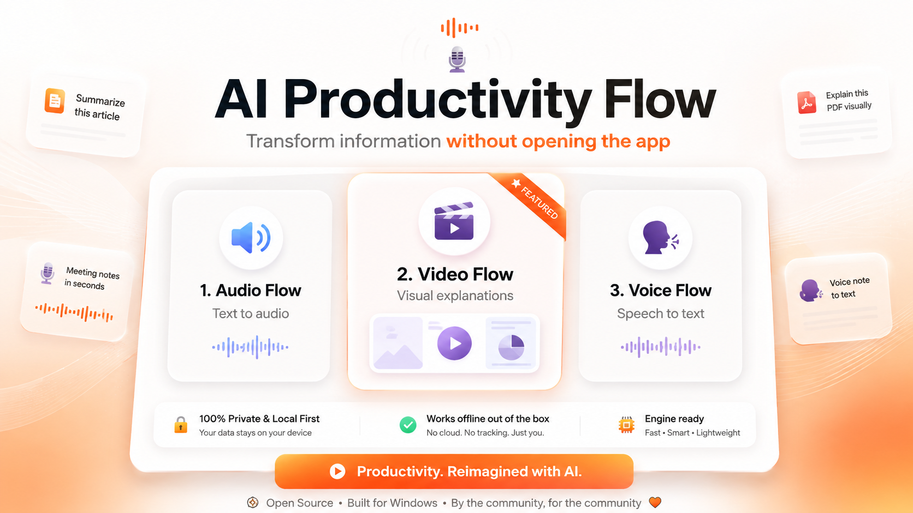

<p align="center">
  
</p>

# AI Productivity Flow

**Speak. Listen. Visualize. Without leaving your workflow.**

> **Windows Beta — ready to use and actively improving.**
>
> Speech recognition runs locally; AI features and online voices use internet
> services you enable — see [Privacy & BYOK](#privacy--byok).

AI Productivity Flow is a Windows desktop AI productivity app that turns speech into polished text, selected content into natural audio, and text or documents into educational visual explainer videos — all triggered from wherever you're already working.

<p align="center">
  
  
  
</p>

```
                          AI PRODUCTIVITY FLOW

        ┌────────────────────┬────────────────────┬────────────────────┐
        │                    │                    │                    │
   🎙 Voice Flow        🔊 Audio Flow        🎬 Video Flow
        │                    │                    │
  Speech → Text          Text → Audio        Text → Visual Video
        │                    │                    │
   Polished text        Spoken content      Visual explanation
        │                    │                    │
        └──────────────── system-wide, across your apps ───────────────┘

     Browser · IDE · documents · email · chat · research · any app
```

## Download for Windows

> **Beta:** AI Productivity Flow is currently available for **Windows 10/11 x64**.
> The app is usable now and actively improving — expect continued fixes and refinement.

Get the latest Windows Beta from **[GitHub Releases](https://github.com/uzerkayat2004-gif/AI-Productivity-Flow/releases)**:

1. Download `AI-Productivity-Flow-Setup-x64.exe`
2. Run the installer
3. Launch AI Productivity Flow
4. Complete the built-in onboarding

No manual Python, Node.js, FFmpeg, npm, Git, or Whisper setup is required — required
runtime and rendering components are bundled or prepared automatically during
installation.

### What works without an AI provider

- ✅ **Voice Flow dictation** with local transcription and deterministic cleanup
- ✅ **Audio Flow** full reading with the free Edge neural voices
- ✅ History, insights, dictionary, and settings

Connecting your own AI provider adds AI polishing, spoken summaries, premium
voices, and **Video Flow generation** (educational planning requires a connected
model).

### System requirements

- Windows 10 / 11 x64
- Internet connection (for AI providers, online voices, and first-run setup)
- A microphone for Voice Flow
- Optional: your own AI provider API key for AI polishing and Video Flow planning

## What AI Productivity Flow Does

### 🎙 Voice Flow — speech → polished text

Hold the **middle mouse button** (or **Ctrl + Win**) anywhere in Windows, speak, and
release. Your words become clean, polished text and are inserted directly into the
app you were using.

- **Local speech recognition** — transcription runs on your machine with the bundled
  Whisper speech model; dictation works without sending audio anywhere.
- **Optional AI polishing** — connect your own AI provider and dictations are
  polished for grammar and clarity, with style awareness per application. Without a
  provider, a deterministic cleanup keeps text tidy.
- **Personal dictionary & corrections** — teach it the names, jargon, and expansions
  you use; longer triggers win and code spans are never rewritten.
- **History & insights** — words, WPM, time saved, streaks, and per-app breakdowns.

### 🔊 Audio Flow — selected content → natural audio

Select text in any application and a small player appears at your cursor. Listen to
the full content, or a spoken **summary** (quick / standard / detailed depth) while
you keep working.

- **Free Edge neural voices by default**, plus premium voices from providers you
  connect (ElevenLabs, OpenAI, Gemini, Google, Deepgram, NVIDIA).
- Play / pause / stop, adjustable reading speed.

### 🎬 Video Flow — text or documents → visual explainer videos

Select text, paste content, or drop in a document (TXT, Markdown, PDF, DOCX, HTML
and more). Video Flow plans an educational breakdown, designs a varied visual
sequence, narrates it, and renders a finished **1080p MP4** with captions —
playable in the built-in player.

- **Educational planning** through a model you connect (explicit consent before
  anything leaves your machine).
- **Creative direction with visual variety** — titles, animated diagrams, flows,
  timelines, counters, wave demos, spatial 3D scenes, recap grids; no two-scene
  monotony.
- **Selectable narration voice** — same voice catalog as Audio Flow, chosen
  independently for videos (clear neural voice by default).
- Progress tracking, one-click cancellation, and full history.

## How It Works Across Your Desktop

AI Productivity Flow lives beside your workflow rather than inside a dashboard: a
small always-on-top Flow Bar, global triggers, and selection awareness mean you
speak, select, listen, or generate a video without switching applications.

## Privacy & BYOK

- **Local by default for speech**: Voice Flow transcription uses the bundled local
  model. Your dictation audio does not require an internet service.
- **You choose the cloud**: AI polishing, Audio Flow summaries, Video Flow
  planning, premium voices, and the default neural voices use internet services —
  advanced AI features use **your own API key** (BYOK) connected through the app's
  provider settings. AI Productivity Flow ships without any developer credentials.
- **Your data stays in your user profile** (`~/.voice_flow`): history, settings,
  and generated videos are stored locally. API keys are stored locally on your
  machine and are **not** encrypted at rest (only OAuth tokens are encrypted) —
  see [SECURITY.md](SECURITY.md).

## What's Included in the Installer

A single per-user installer (no admin required) that bundles everything the app
needs: a private Python runtime, Node.js, FFmpeg, the Whisper speech model, the
deterministic video renderer, and automatic setup of the remaining rendering
components. An internet connection is used for online AI/TTS services you enable
and for one-time component preparation.

## Current Architecture

- **Voice Flow**: local `faster-whisper` transcription (bundled model) → optional
  provider-based polishing (failover pool + deterministic fallback) → dictionary
  post-processing → direct insertion into the target window.
- **Audio Flow**: selection capture → optional LLM summary (consent-gated) →
  multi-provider TTS engine (Edge default).
- **Video Flow**: source extraction → educational planning (connected model,
  consent-gated) → Creative Director (15 visual treatments, diversity limits) →
  scene authoring with a per-video design system → browser-based deterministic
  rendering → narration + captions → FFmpeg normalization → 1080p MP4.
- **Shell**: pywebview dashboard on a loopback-only local API, always-on-top Flow
  Bar, Win32 global hooks with self-healing watchdogs, per-user data under
  `~/.voice_flow`.

Details: [VIDEO_FLOW_ARCHITECTURE.md](VIDEO_FLOW_ARCHITECTURE.md) ·
[docs/CURRENT_PRODUCT_MAP.md](docs/CURRENT_PRODUCT_MAP.md)

## Project Status

Functional across Voice Flow, Audio Flow, and Video Flow, with a self-contained
Windows installer that has been built and validated locally (install, uninstall,
packaged pipeline, bundled speech model, test suite). A completely fresh external
Windows-machine acceptance run is still pending, which is why the current download
is published as a **Beta pre-release**. Feedback from different Windows systems is
especially valuable.

## Development / Contributing

The repository runs from source for development — see
[CONTRIBUTING.md](CONTRIBUTING.md) for the developer environment, test suite, and
contribution rules. Normal users should use the installer above, not a source
checkout.

## Security

See [SECURITY.md](SECURITY.md).

## License

Apache-2.0 — see [LICENSE](LICENSE). Third-party components distributed with the
installer are attributed in [release/THIRD_PARTY_NOTICES.txt](release/THIRD_PARTY_NOTICES.txt).
