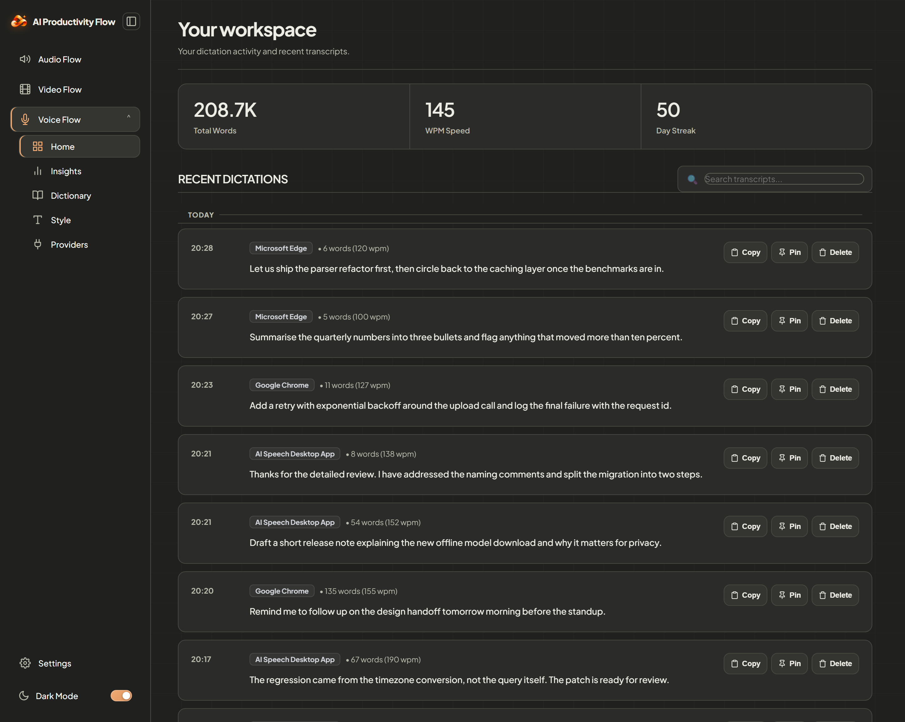
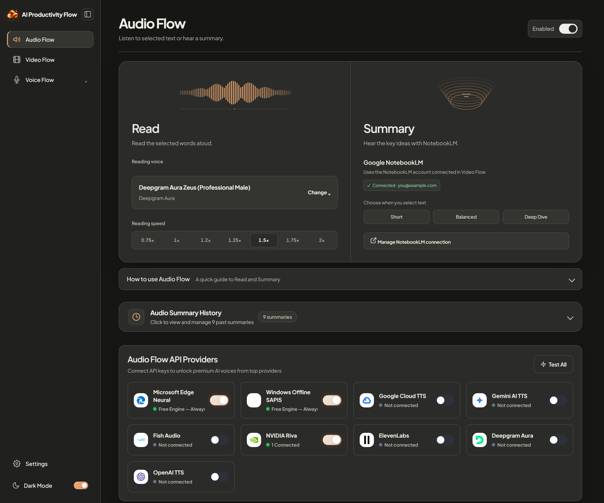
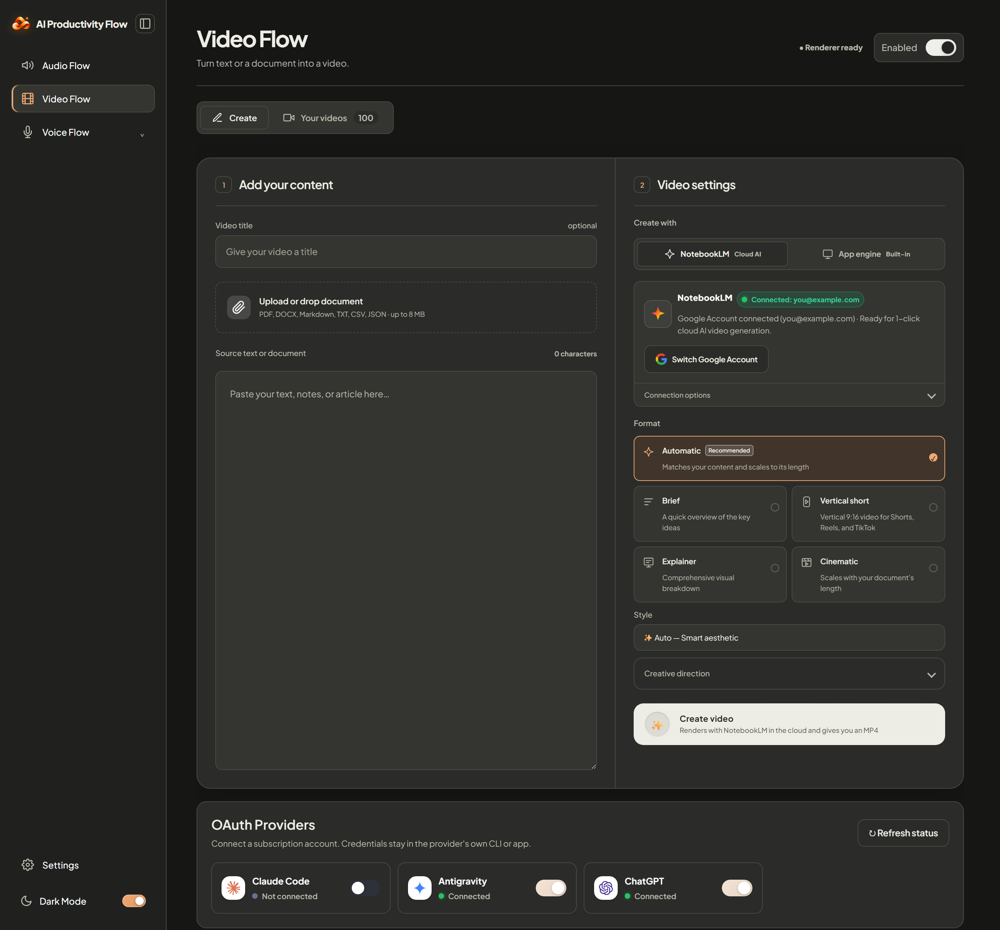
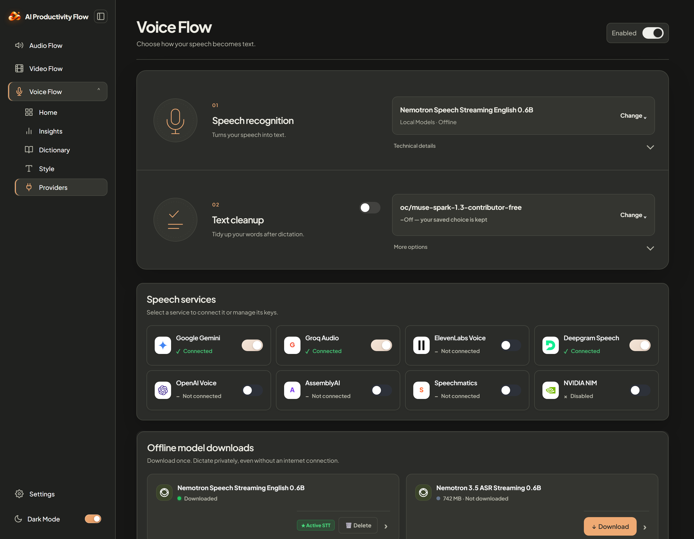

# 🌊 AI Productivity Flow

<p align="center">
  <b>Turn speech into text, text into audio, and notes into videos — anywhere on your computer.</b><br>
  <i>A free, private, lightweight desktop AI assistant that works inside every app you already use.</i>
</p>

<p align="center">
  <a href="https://github.com/uzerkayat2004-gif/AI-Productivity-Flow/releases"></a>
  
  
  
  <a href="LICENSE"></a>
</p>

<p align="center">
  
</p>

---

## ⚡ What is AI Productivity Flow?

**AI Productivity Flow** is built around one simple truth:
> **You shouldn't have to leave the app you're working in just to use AI.**

Forget switching tabs to ChatGPT, copy-pasting text back and forth, or typing long emails by hand. Flow runs quietly in the background on your desktop. Whenever you need it, a single mouse click or text selection unleashes instant superpowers:

* 🎙️ **Voice Flow** — Speak naturally. It types clean, polished, error-free text directly into whatever app you have open (Slack, Word, Gmail, VS Code, or any browser).
* 🎧 **Audio Flow** — Tired of reading? Highlight any text or article, and a sleek player reads it out loud in warm, natural human voices while highlighting words as it speaks.
* 🎬 **Video Flow** — Turn dry text, notes, or PDFs into beautiful 1080p animated explainer videos with narration, charts, and captions in seconds.
* 📓 **NotebookLM Magic** — Connect your Google research notebooks for instant access to your notes, summaries, and audio discussions.
* 🔒 **100% Private & Free** — Speech is transcribed offline right on your computer. Your microphone is never listening in the background, and all basic features are 100% free with zero subscriptions.

---

## 🚀 Quick Install (Get Started in 60 Seconds)

Choose the method that suits you best:

### 🪟 Windows 10 & 11 (Primary & Fully Tested)

* **Option 1: The Easy 1-Line Command (Fastest)**  
  Press `Win + X`, open **PowerShell** (no Administrator required), and paste:
  ```powershell
  irm https://raw.githubusercontent.com/uzerkayat2004-gif/AI-Productivity-Flow/main/scripts/install.ps1 | iex
  ```
  *(This automatically sets up the environment, downloads speech models, puts a shortcut on your Desktop, and launches Flow!)*

* **Option 2: Standalone Installer**  
  Prefer a classic setup file? Download **`AI-Productivity-Flow-Setup-x64.exe`** from our **[GitHub Releases](https://github.com/uzerkayat2004-gif/AI-Productivity-Flow/releases)** page and run it.

---

### 🍎 macOS 12+ Apple Silicon & Intel (Community Preview)

Open your Mac **Terminal** and paste:
```bash
curl -fsSL https://raw.githubusercontent.com/uzerkayat2004-gif/AI-Productivity-Flow/main/scripts/install.sh | bash
```

> [!WARNING]
> **⚠️ Note for Mac Users (Community Preview):**  
> macOS support is currently in **Community Preview** and has not yet undergone full physical hardware testing on every Mac generation. While the core features work, you may encounter system permission prompts (Microphone, Accessibility, Input Monitoring) or minor hotkey differences.  
>  
> **Windows 10/11 x64 is the primary, production-verified platform.** If you run into any quirks or bugs on Mac, please help us improve by reporting them on [GitHub Issues](https://github.com/uzerkayat2004-gif/AI-Productivity-Flow/issues)!

---

## 💡 Everyday Magic: How You'll Use Flow Every Day

| What you want to do | How Flow makes it effortless |
| :--- | :--- |
| **Write an email or document without typing** | Hold your **Middle Mouse Button** (or press `Ctrl + Win`), speak naturally, and release. Flow types clean, grammatically correct sentences with no typos or "ums". |
| **Rest your eyes and listen to an article** | Highlight any paragraph or article on your screen. The **Audio Bar** pops up instantly, reading each sentence aloud in natural human voices. |
| **Explain a complex note or PDF visually** | Select any text or drag-and-drop a file. Click **Video**, and Flow automatically generates an educational 1080p MP4 video summary with visuals and voiceover. |
| **Review research from Google NotebookLM** | Sign in securely to sync your Google NotebookLM research notebooks directly to your desktop workflow. |

---

## 🌟 The Core Superpowers

### 1. 🎙️ Voice Flow — Talk Instead of Typing
Stop typing thousands of words every day. Speak naturally, and Flow will type for you anywhere your cursor is placed.

<p align="center">
  
</p>

* **Simple Gestures**: Hold down your **Middle Mouse Button** (scroll wheel) or press `Ctrl + Win` (`Cmd + Ctrl` on Mac) while speaking. Release when done, and watch the text appear!
* **Removes Hesitations**: Flow automatically cleans up slips of the tongue, filler words ("uh", "um", "like"), and pauses while keeping your exact meaning intact.
* **App-Aware Smart Formatting**:
  * In **Word / Outlook / Gmail**: Writes formal, well-punctuated, professional paragraphs.
  * In **Slack / Discord / Teams**: Keeps messages friendly, natural, and concise.
  * In **VS Code / IDEs**: Automatically formats programming keywords, `snake_case`, and markdown blocks.
* **Personal Dictionary & Shortcuts**: Teach Flow your name, specialized technical jargon, or custom abbreviations (e.g. say or type `myzoom` to paste your Zoom meeting link).
* **100% Offline Speech Engine**: Transcribes directly on your processor using offline Faster-Whisper. Audio is processed on your PC and is never sent to the cloud.

---

### 2. 🎧 Audio Flow — Turn Any Text Into Speech
Turn any web page, document, code comment, or email into an instant personal podcast.

<p align="center">
  
</p>

* **Highlight & Listen**: Just select text on any screen. A floating mini-player appears right at your cursor.
* **Synchronized Yellow Word Tracker**: Words illuminate in real-time as they are spoken, making it effortless to follow along.
* **Full Playback Control**: Adjust reading speed from 0.8x to 2.0x, scrub through the waveform timeline, jump back 10 seconds, or save the speech as an MP3 file with one click.
* **Spoken AI Summaries**: Pressed for time? Click **Quick Summary** or **Deep Dive** and have the AI summarize the text before reading it to you.
* **Free Natural Human Voices**: Ships with ultra-realistic Microsoft Edge Neural voices out of the box with zero setup. Also supports Google Cloud, Gemini Audio, ElevenLabs, and OpenAI voices if you want extra variety.

---

### 3. 🎬 Video Flow — Turn Notes into Engaging 1080p Videos
Why read walls of text when you can watch a concise, visually rich explainer video?

<p align="center">
  
</p>

* **Drag-and-Drop Any Document**: Highlight text or drop files (`.pdf`, `.docx`, `.txt`, `.md`, `.csv`, `.json`).
* **Automated Storyboarding**: Flow analyzes the key ideas and structures an educational, multi-scene visual presentation.
* **15 Dynamic Visual Treatments**: Keeps viewers engaged with dynamic title cards, animated timelines, data charts, flowcharts, metric counters, and 3D WebGL scenes.
* **100% Free Animation Guarantee**: You don't need expensive paid video AI subscriptions. Flow includes a built-in deterministic motion renderer that builds full 1080p MP4 videos with narration and subtitles for free!
* **Built-in Video Player**: Watch right inside the app, scrub scenes, toggle subtitles, or export to your video folder.

---

### 4. 📓 NotebookLM Deep Research Integration
Bring the power of Google NotebookLM into your daily desktop flow:
* **One-Click Browser Connection**: Easily sign in with your Google account.
* **Persistent & Resilient**: Modern Chrome cookie support keeps your session healthy without requiring you to re-login every time you restart your PC.
* **Instant Research Summaries**: Pull your deep notes and study guides directly into audio or video summaries.

---

### 5. 🔑 Bring Your Own Key (BYOK) — Or Stay 100% Free
AI Productivity Flow is built for everyone:

<p align="center">
  
</p>

* **100% Free Out of the Box**: Offline speech recognition and natural voice playback work out of the box without signing up for any accounts or paying any money.
* **Connect Any AI Provider (Optional)**: If you want to use cloud AI for extra-smart text polishing or video planning, you can easily plug in your own API key:
  * **OpenAI** (GPT-4o, GPT-4o-mini, o1, o3-mini)
  * **Anthropic** (Claude 3.5 Sonnet, Claude 3.5 Haiku)
  * **Google Gemini** (Gemini 2.0 Flash, Gemini 1.5 Pro)
  * **DeepSeek, Groq, Mistral, NVIDIA**
  * **Local Offline AI** via Ollama (completely free and private!)
* **Complete Privacy**: Your API keys are encrypted and stored solely on your machine. We never see or store your keys.

---

### 6. 🎨 Beautiful Dark & Light Themes
Whether you prefer a calm dark mode or a bright paper parchment theme, Flow automatically adapts to your operating system's settings with a smooth, instant toggle.

---

## ⌨️ Shortcut Cheat Sheet

| Action | Shortcut / Gesture | What it does |
| :--- | :--- | :--- |
| **Talk to Type (Voice Flow)** | **Middle Mouse Button** (Hold & Release)<br>or `Ctrl + Win` (`Cmd + Ctrl` on Mac) | Hold down, speak freely, and release to paste formatted text into your active app. |
| **Screen Reader & Video (Flow Bar)** | **Select / Highlight any text** on screen | A sleek mini-bar appears with **🎙️ Voice**, **🎧 Audio**, and **🎬 Video** buttons. |
| **Settings & History Dashboard** | Open **`http://127.0.0.1:8991`** in your browser | Access your dictation history, personal dictionary, voice settings, and AI keys. |

---

## 🔒 Privacy & Safety First

* 🛡️ **Offline Speech Processing**: All voice dictation is processed on your local CPU/GPU using the built-in Faster-Whisper model. Your voice audio never leaves your computer.
* 🛡️ **No Background Listening**: The microphone only activates during the exact moments you press the trigger button. There is no passive listening.
* 🛡️ **Zero Analytics or Tracking**: We do not collect telemetry, track your keystrokes, or monitor what you write.
* 🛡️ **Local SQLite Database**: Your history and personal dictionary entries are stored securely on your own hard drive (`~/.voice_flow/voice_flow.db`).

---

## 🛠️ For Developers & Manual Setup

<details>
<summary><b>Click here to view Developer Setup & Manual Build Guide</b></summary>

### Prerequisites
* **Operating System**: Windows 10/11 x64 or macOS 12+
* **Python**: 3.10+ (tested on 3.11, 3.12, 3.13, 3.14)
* **Node.js**: 18+ (optional, for local video rendering components)

### Manual Installation
```bash
# 1. Clone the repository
git clone https://github.com/uzerkayat2004-gif/AI-Productivity-Flow.git
cd AI-Productivity-Flow

# 2. Create and activate a virtual environment
python -m venv .venv
# On Windows:
.\.venv\Scripts\activate
# On macOS:
source .venv/bin/activate

# 3. Install dependencies in editable mode
pip install -e .

# 4. (Optional) Install local video renderer modules
cd video_flow_renderer
npm install
cd ..
```

### Running Locally
* **Windows Silent Mode**: Run `.\run_voice_flow.bat` or launch `VoiceFlowLauncher.vbs`.
* **Windows Console Mode**: Run `.\run_voice_flow.bat --console`.
* **macOS Terminal**: Run `python3 -m voice_flow.main`.

### Running Tests
All unit and integration tests run offline with zero external API calls:
```bash
# Cross-platform contract and runtime tests
pytest tests/test_platform_layer.py tests/test_runtime_compatibility.py -v

# Video Flow and Audio Flow tests
pytest tests/test_video_flow_engine.py tests/test_video_flow_providers.py tests/test_audio_video_download_and_player_fixes.py -v

# Core features (Dictionary, Insights, Style Presets)
pytest tests/test_insights_deep.py tests/test_history_features.py tests/test_dictionary_safety.py -v
```

### Technical Documentation
Detailed technical specifications and design docs are available in [`docs/`](docs/):
* [`docs/CURRENT_PRODUCT_MAP.md`](docs/CURRENT_PRODUCT_MAP.md) — Comprehensive technical architecture map
* [`docs/PRODUCT_FACTS.md`](docs/PRODUCT_FACTS.md) — Verified technical specifications
* [`VIDEO_FLOW_ARCHITECTURE.md`](VIDEO_FLOW_ARCHITECTURE.md) — Video Flow rendering pipeline deep dive

</details>

---

## 📢 Community & Support

* 📦 **Downloads & Updates**: [GitHub Releases](https://github.com/uzerkayat2004-gif/AI-Productivity-Flow/releases)
* 🐛 **Report a Bug or Request a Feature**: [GitHub Issues](https://github.com/uzerkayat2004-gif/AI-Productivity-Flow/issues)
* 💬 **Website**: [Productivity Flow Landing Page](https://uzerkayat2004-gif.github.io/AI-Productivity-Flow/)

---

## 📄 License

This project is open-source under the **Apache License 2.0**. See the [`LICENSE`](LICENSE) file for details.  
All third-party libraries (Whisper, SoundDevice, PyWebView, React, Three.js) remain subject to their respective licenses cataloged in [`release/THIRD_PARTY_NOTICES.txt`](release/THIRD_PARTY_NOTICES.txt).
