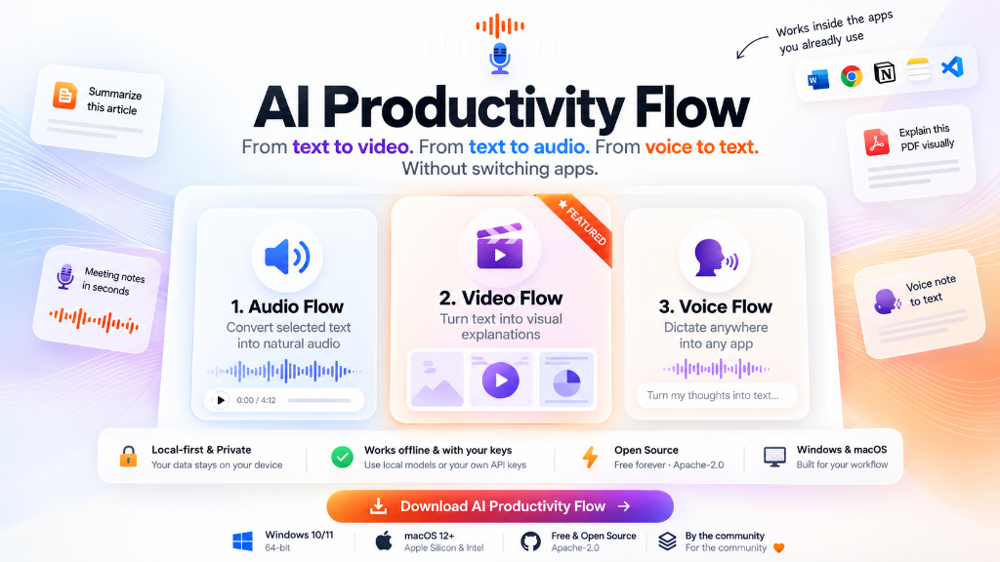

<h1 align="center">🌊 AI Productivity Flow</h1>

<p align="center">
  <b>From text to video. From text to audio. From voice to text. Without switching apps.</b><br>
  <i>A free, open-source desktop AI system for Windows and macOS designed to work inside your existing workflow.</i>
</p>

<p align="center">
  <a href="https://github.com/uzerkayat2004-gif/AI-Productivity-Flow/releases/latest"></a>
  
  
  
  <a href="https://ai-productivity-flow.vercel.app/"></a>
</p>

<p align="center">
  
</p>

---

## ⚡ What is AI Productivity Flow?

AI Productivity Flow is a desktop AI system engineered to operate seamlessly alongside the apps you already use. Instead of copying and pasting text into separate browser windows or siloed AI chat services, Flow stays quietly accessible across your entire operating system.

Select any text, notes, or documentation on screen, or tap a global shortcut to speak naturally:

1. **🎬 Video Flow** — Generate visual explainer videos with narration and synchronized motion graphics.
2. **🎧 Audio Flow** — Read text aloud or listen to structured multi-depth audio summaries.
3. **🎙️ Voice Flow** — Dictate directly into any focused application with instant text injection.

---

## 📥 Downloads & Installation

### Windows 10 & 11 (64-bit)

* **Direct Installer**: Download the standalone installer **[`AI-Productivity-Flow-Setup-x64.exe`](https://github.com/uzerkayat2004-gif/AI-Productivity-Flow/releases/latest/download/AI-Productivity-Flow-Setup-x64.exe)** from the latest stable release.
* **Checksum**: [`AI-Productivity-Flow-Setup-x64.exe.sha256`](https://github.com/uzerkayat2004-gif/AI-Productivity-Flow/releases/latest/download/AI-Productivity-Flow-Setup-x64.exe.sha256)
* **Terminal Install** (PowerShell, per-user, no admin required):
  ```powershell
  irm https://raw.githubusercontent.com/uzerkayat2004-gif/AI-Productivity-Flow/main/scripts/install.ps1 | iex
  ```

### macOS 12+ (Apple Silicon & Intel)

* **Application Bundle**: Download **[`AI-Productivity-Flow-macOS.zip`](https://github.com/uzerkayat2004-gif/AI-Productivity-Flow/releases/latest/download/AI-Productivity-Flow-macOS.zip)**.
* **Checksum**: [`AI-Productivity-Flow-macOS.zip.sha256`](https://github.com/uzerkayat2004-gif/AI-Productivity-Flow/releases/latest/download/AI-Productivity-Flow-macOS.zip.sha256)
* **Terminal Install** (Bash / Zsh):
  ```bash
  curl -fsSL https://raw.githubusercontent.com/uzerkayat2004-gif/AI-Productivity-Flow/main/scripts/install.sh | bash
  ```

---

## 🌟 The Three Pillars of Flow

### 1. 🎬 Video Flow — Turn Selected Text into Visual Explainer Videos

Video Flow transforms dense articles, technical notes, or documentation into structured, animated MP4 explainer videos with synchronized voiceover narration.

```
Source Text / Notes
       │
       ▼
AI Planning & Concept Extraction (Gemini / OpenAI / Claude / Local)
       │
       ▼
Creative Director & Scene Authoring (Key ideas, visual hierarchy, layout)
       │
       ▼
Controlled Rendering Pipeline (Kinetic typography, diagrammatic cards, transitions)
       │
       ▼
Finished Explainer Video (.mp4 saved to Downloads + in-app player)
```

* **Multi-Engine Rendering Pipeline**: AI understands and plans scene intent; Flow's Creative Director shapes pacing, layout, and visual rhythm; controlled local rendering compiles the final video.
* **Google NotebookLM Integration**: Directly connect NotebookLM research notebooks for audio and visual synthesis.
* **Visual Styles & Themes**: Choose between distinct visual presentations (Dark Editorial, Minimal Technical, Kinetic Modern).
* **Deterministic Fallback**: Local deterministic visual layout engine ensures rendering completes reliably even if external APIs experience rate limits.
* **Export & Control**: Export high-definition MP4 videos directly to your system Downloads folder with playback controls and job management.

### 2. 🎧 Audio Flow — Spoken Readers & Multi-Depth Audio Summaries

Audio Flow gives you two dedicated ways to absorb written content without eye strain:

* **Read Mode (Spoken Explainer)**: An intelligent reader designed to articulate selected paragraphs, articles, or documentation naturally. Rather than robotic text playback, it speaks with natural human cadence, clear phrasing, and synchronized playback.
* **Summary Mode (Multi-Depth Audio Summaries)**:
  * **Short**: Fast high-level briefs for quick updates.
  * **Balanced**: Structured conceptual overviews capturing key arguments and takeaways.
  * **Deep Dive**: Thorough breakdown analyzing context, evidence, and implications for long documents.
* **Integrated Audio Player**: Mini on-screen and full-window player with playback rate controls (0.75x to 2.0x), waveform progress scrubbing, and instant MP3 download.
* **Voice Ecosystem**: Use high-clarity Edge TTS (free, no account required), or connect premium providers including Cartesia, ElevenLabs, OpenAI TTS, Google Cloud TTS, or local system speech.

### 3. 🎙️ Voice Flow — System-Wide Voice Dictation & Text Injection

Voice Flow lets you speak naturally and injects clean, formatted text directly into whatever application is currently focused—Slack, Word, VS Code, Notion, browser inputs, or terminal windows.

* **Local-First Dictation**: Bundled local **Faster-Whisper** engine runs completely on-device across CPU or GPU without requiring internet access.
* **Downloadable Streaming Models**: Optional download of **NVIDIA Nemotron Speech Streaming English 0.6B** and **Nemotron 3.5 ASR Streaming 0.6B** for real-time streaming speech recognition.
* **Cloud STT Providers**: Connect Deepgram, Groq Whisper, OpenAI Whisper, or Gemini STT for instant cloud-accelerated transcription.
* **On-Device & Cloud AI Polish**:
  * Downloadable on-device **Liquid LFM 1.3B/3B** via llama.cpp for private text polishing.
  * Windows AI Text Rewriter where supported by hardware.
  * Optional cloud LLMs (Gemini, Claude, OpenAI, Groq, Ollama) for smart cleanup, conversational rewriting, and prompt formulation.
* **Personal Dictionary & Snippets**: Add custom acronyms, jargon, and snippet abbreviations that expand automatically with cross-process memory.

---

## 🔒 Privacy & Security Architecture

* **Local-First by Design**: Core features run on-device. Audio processed by local Faster-Whisper or on-device models never leaves your computer.
* **Explicit Cloud Routing (BYOK)**: When you select a cloud provider, only the text or audio required for that specific request is transmitted to that provider. No central tracking intermediary is used.
* **Local Storage**: Dictation history, audio recordings, and provider credentials reside locally in SQLite databases inside `~/.voice_flow/`.
* **Encrypted Backups**: The `.flowvault` export/import format secures account profiles, preferences, and custom dictionaries using **AES-256-GCM** encryption.
* **Loopback Desktop API**: The internal GUI HTTP and WebSocket server binds strictly to `127.0.0.1:8991` with Origin, Host, and port verification to prevent cross-origin browser access.

---

## ⌨️ Global Shortcuts

| Platform | Default Shortcut | Action |
|:---|:---|:---|
| **Windows** | `Ctrl + Win` | Start / Stop voice dictation into active input |
| **Windows** | `Alt + Space` (Optional) | Configurable secondary dictation trigger |
| **Windows** | `Middle Mouse Click` (Optional) | Push-to-talk with mouse button |
| **macOS** | `Cmd + Option` | Start / Stop voice dictation into active input |

---

## 🛠️ Development & Building from Source

To set up a local development environment or contribute:

```bash
# Clone the repository
git clone https://github.com/uzerkayat2004-gif/AI-Productivity-Flow.git
cd AI-Productivity-Flow

# Create and activate a virtual environment
python -m venv .venv
# Windows:
.\.venv\Scripts\activate
# macOS / Linux:
source .venv/bin/activate

# Install editable package with test dependencies
pip install -e .
pip install pytest pytest-asyncio pytest-timeout cryptography

# Run the test suite
pytest tests/test_platform_layer.py tests/test_runtime_compatibility.py tests/test_version_consistency.py
```

For full details on project architecture, code conventions, and packaging pipelines, see [CONTRIBUTING.md](CONTRIBUTING.md).

---

## 📄 License

AI Productivity Flow is open-source software licensed under the [Apache-2.0 License](LICENSE).
Third-party component notices and licenses are documented in [release/THIRD_PARTY_NOTICES.txt](release/THIRD_PARTY_NOTICES.txt).
